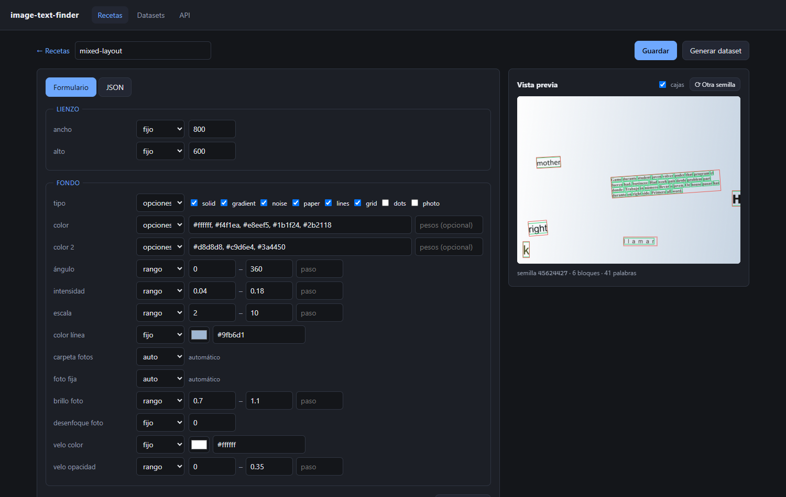

# image-text-finder — dataset API

An API that generates synthetic **text-on-image** datasets for training a text-detection CNN.
Text is laid out as real HTML/CSS in a headless Chromium, so paragraphs wrap, justify and
letter-space exactly like a browser does — and the bounding boxes come straight out of the
DOM, which means the ground truth is exact rather than estimated.

## The three layers

| Layer | What it is | Lives where |
|---|---|---|
| **Recipe** | The template you author. Every field is either a fixed value or a distribution. | Your JSON |
| **Spec** | `resolve(recipe, seed)` → every value concrete: position, font, size, color, text. | `specs.jsonl` |
| **Render** | `render(spec)` → PNG + mask + labels. A *pure function* of the spec. | `images/`, cache |

That split is what makes the storage promise work: **the specs are the dataset, the PNGs are a
cache.** Delete a hundred gigabytes of images, rebuild them later, and you get the same pixels
back. The labels never depend on the pixels, so they are stable no matter what.

## Setup

```bat
python -m venv .venv
.venv\Scripts\pip install -r requirements.txt
.venv\Scripts\python -m playwright install chromium
.venv\Scripts\python -m app.serve --reload
```

Then open <http://127.0.0.1:8000/> for the web app, or `/docs` for the interactive API docs.

Every command here calls `.venv\Scripts\python` explicitly, so it works whether or not the
virtualenv is activated. Running a bare `uvicorn app.main:app` will fail with *"uvicorn" is not
recognized* — uvicorn lives inside the venv, not on your PATH. Activate it first
(`.venv\Scripts\activate`) if you'd rather type the short form.

**Why `app.serve` instead of `uvicorn app.main:app`?** On Windows, `uvicorn --reload` picks a
SelectorEventLoop, and asyncio cannot spawn subprocesses on that loop — so Playwright's driver
dies at startup with a bare `NotImplementedError`. [app/serve.py](app/serve.py) forces the
ProactorEventLoop back, which is the only loop that can. Plain `uvicorn app.main:app` (no
`--reload`) works fine, since that path already gets the Proactor loop.

## The web app



Two screens, both of them plain HTTP clients of the API below — the UI holds no logic of its
own, so anything it can do, your other system can do too.

**Recetas** is CRUD over the definitions. The editor gives every field a mode —
`fijo`, `rango`, `opciones`, `auto` — which is the recipe model made clickable: pin what
matters, leave the rest random. A live preview re-renders as you type (debounced), draws the
word and block boxes over it, and rerolls the seed on demand. A JSON tab exposes the raw recipe
for anything the form doesn't cover; the two stay in sync.

**Datasets** is CRUD over the generated sets: create from a recipe, build the PNGs with a
progress bar, browse them in a gallery, click one to inspect its labels and mask, rename,
download as a ZIP, or free the images while keeping the specs.

Deleting or editing a recipe never touches a dataset that was generated from it: each dataset
stores a frozen copy of the recipe as it was at creation time, and that copy — not the recipe
id — is what regenerates the images.

**Using a Chromium you already have.** If `playwright install` won't cooperate, point the app
at any Chromium/Chrome binary instead. It must be set *before* you start the server:

```bat
set ITF_CHROMIUM_PATH=C:\path\to\chrome.exe
.venv\Scripts\python -m uvicorn app.main:app --reload
```

`set` only lasts for that console window. `setx ITF_CHROMIUM_PATH "C:\path\to\chrome.exe"` makes
it permanent — but it does not affect the window you type it in, so open a new one.

(Note that `chrome.exe --version` prints nothing on Windows — it's a GUI binary and doesn't
attach to the console. That is not a sign it's broken.)

Drop `.ttf`/`.otf` files in `assets/fonts/` and photos in `assets/backgrounds/`. With no fonts
installed the API falls back to common system families (Arial, Georgia, …) — fine to start, but
embedding real font files is what makes renders reproducible across machines.

## Writing a recipe

Any parameter accepts a literal *or* a distribution, which is how you pin what matters and let
the rest vary:

```jsonc
"font_size": 14                                    // fixed
"font_size": { "range": [12, 28] }                 // uniform
"font_weight": { "range": [400, 700], "step": 300 }// snapped to a grid
"align": { "choice": ["left", "justify"], "weights": [3, 1] }
```

A block is a paragraph, a word, a single letter, or `spaced` (wide letter-spacing). `count` says
how many of them, and it can itself be a range:

```jsonc
{
  "canvas": { "width": 800, "height": 600 },
  "background": { "kind": { "choice": ["paper", "gradient", "photo"] } },
  "blocks": [
    {
      "kind": "paragraph",
      "count": { "range": [1, 3], "step": 1 },
      "width": { "range": [260, 460] },          // height grows with the text
      "typography": {
        "font_size": { "range": [13, 22] },      // random per paragraph...
        "color": "auto"                          // ...but consistent *within* it
      },
      "placement": { "angle": { "range": [-4, 4] }, "avoid_overlap": true }
    }
  ]
}
```

Font, size and color resolve **at the block level**, so a paragraph is typographically
consistent inside itself while varying across the dataset — which is what you asked for and
also what a detector needs to see.

`"color": "auto"` samples the background under the block and picks a color that clears
`min_contrast` (WCAG ratio). Set an explicit hex if you want to control legibility yourself,
including making it deliberately hard.

Backgrounds: `solid`, `gradient`, `noise`, `paper`, `lines`, `grid`, `dots`, `photo`.
`photo` picks from `assets/backgrounds/`, crops it to the canvas aspect, and can wash it with
`overlay_alpha` to keep text readable.

See [examples/mixed_layout.json](examples/mixed_layout.json).

## Endpoints

```
GET    /recipes                                the stored definitions
POST   /recipes                                {name, recipe} -> stored recipe
GET    /recipes/defaults                       a blank recipe + a blank block (the form is built from this)
GET    /recipes/{id}
PUT    /recipes/{id}                           partial: send name, recipe, or both
POST   /recipes/{id}/duplicate
DELETE /recipes/{id}

POST   /recipes/resolve                        recipe + seed -> frozen spec
POST   /render                                 spec (or recipe+seed) -> {spec, labels, image, mask}
POST   /render/preview.png                     the same, straight back as a PNG

POST   /datasets                               {recipe_id | recipe} + count -> N specs on disk (no pixels)
GET    /datasets                               list, with images built and bytes on disk
GET    /datasets/{id}
PATCH  /datasets/{id}                          rename
POST   /datasets/{id}/build                    materialize PNGs + masks + labels (background job)
GET    /datasets/{id}/build                    poll: {state, done, total}
GET    /datasets/{id}/specs/{i}                the frozen spec for one item
GET    /datasets/{id}/items/{i}/image.png      renders on demand and caches
GET    /datasets/{id}/items/{i}/mask.png
GET    /datasets/{id}/items/{i}/labels.json
GET    /datasets/{id}/archive.zip              everything built so far
DELETE /datasets/{id}/artifacts                drop the pixels, keep the specs  <- frees disk
DELETE /datasets/{id}                          drop everything

GET    /fonts        POST /fonts/refresh       GET /backgrounds/photos
```

## Labels

Each item gets hierarchical ground truth — `blocks`, `lines`, `words` — with both an
axis-aligned `box` (`x, y, w, h`) and a rotated `quad` (4 corners), plus the binary segmentation
`mask.png`. A build also writes `labels.jsonl`, one line per item, which is the file a
dataloader iterates:

```jsonc
{
  "image_id": "mixed-a1b2/000007",
  "width": 800, "height": 600,
  "words": [
    { "block_id": "b0", "line_index": 2, "text": "gobierno",
      "box": [131.0, 88.4, 62.2, 15.0],
      "quad": [[131.0, 88.4], [193.2, 88.4], [193.2, 103.4], [131.0, 103.4]] }
  ],
  "has_overlap": false
}
```

The mask is the **same DOM rendered twice**: once normally, once with a stylesheet that blacks
out the background and forces every glyph to pure white — so it is pixel-exact and, unlike the
image, never blurred or noised by the post-processing.

`has_overlap` is honest bookkeeping. Overlap avoidance happens at resolve time on *estimated*
paragraph heights — the true height isn't known until the browser lays the text out — so it is
best-effort, and this flag is computed after the fact from the real boxes. Filter on it if your
training needs clean samples.

Measured on `examples/mixed_layout.json`, ~10% of samples still come out with some overlap. Two
separate causes, worth knowing apart: the height estimate can run ~13% under the truth for wide
fonts, and a dense recipe can simply ask for more blocks than fit. If you need a lower rate,
drop the block `count`s or narrow the paragraph `width` — density is the dominant term.

## Determinism, precisely

`resolve()` derives every sub-seed from the root seed **and the parameter's path**
(`blocks[1][0].font_size`), not from a running stream. Adding a block to a recipe therefore
does not reshuffle the blocks around it — an edit you make on Tuesday doesn't invalidate
Monday's dataset.

Rendering is deterministic on a given machine and Chromium build. Across *different* OSes,
Chromium makes no pixel-exactness guarantee (font rasterisation differs), so pin the container
if you need bit-identical PNGs on two machines. The **labels are always exact**, because they
come from the layout, not from the pixels.

## Testing

```bash
.venv\Scripts\python -m pytest -q
```

`tests/test_render.py` does the check that actually matters: it rasterises the label quads and
asserts the mask's text ink falls inside them — i.e. the ground truth agrees with the pixels,
rotation included.

To eyeball it:

```bash
.venv\Scripts\python scripts\demo.py examples\mixed_layout.json --n 4 --out out\demo
```

which writes each sample plus an overlay with the word quads drawn on top.
